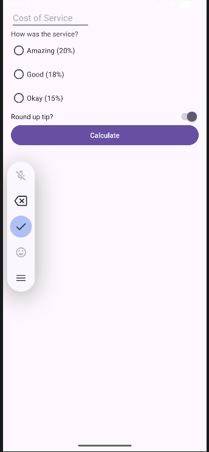
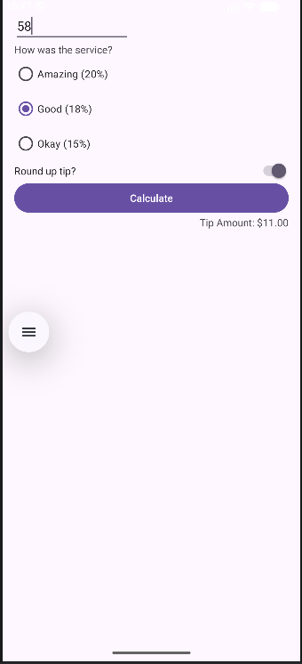

# <center>IES FRANCISCO DE GOYA</center>
__NOMBRE:__ Martin Taboada  
__CURSO:__ DAM 2
## <center> __Programación Multimedia y Dispositivos Móviles:__</center>   <center> __Como calcular propina__</center>
A continuación se presentarán evidencias sobre el ejercicio planteado en el aula virtual, se presentarán tanto las imágenes como el texto plano del fragmento del código: 
### __MainActivity.kt__
```
package com.example.tiptime

import android.os.Bundle
import androidx.activity.enableEdgeToEdge
import androidx.appcompat.app.AppCompatActivity
import androidx.core.view.ViewCompat
import androidx.core.view.WindowInsetsCompat
import com.example.tiptime.databinding.ActivityMainBinding
import java.text.NumberFormat

class MainActivity : AppCompatActivity() {

    lateinit var binding: ActivityMainBinding

    override fun onCreate(savedInstanceState: Bundle?) {
        super.onCreate(savedInstanceState)
        binding = ActivityMainBinding.inflate(layoutInflater)
        setContentView(binding.root)
        binding.btnCalculete.setOnClickListener { calculateTip() }


    }
    fun calculateTip(){
       val stringInTextField = binding.etCostOfService.text.toString()
       val cost = stringInTextField.toDoubleOrNull()
        if(cost == null){
            binding.tipResult.text= ""
            return
        }
        val selectedId = binding.rgTipOptions.checkedRadioButtonId
        val tipPorcentage = when (selectedId){
            R.id.rbTwentyPercent -> 0.20
            R.id.rbEightTeenPercent -> 0.18
            else -> 0.15
        }
        var propina = cost*tipPorcentage
        if(binding.sRoundUp.isChecked){
            propina = kotlin.math.ceil(propina)
        }
        NumberFormat.getCurrencyInstance()
        val formattedTip = NumberFormat.getCurrencyInstance().format(propina)
        binding.tipResult.text = getString(R.string.app_name, formattedTip)

    }
}
```
### __activity_main.xml__
```
<?xml version="1.0" encoding="utf-8"?>
<androidx.constraintlayout.widget.ConstraintLayout xmlns:android="http://schemas.android.com/apk/res/android"
    xmlns:app="http://schemas.android.com/apk/res-auto"
    xmlns:tools="http://schemas.android.com/tools"
    android:id="@+id/main"
    android:layout_width="match_parent"
    android:layout_height="match_parent"
    android:padding="16dp"
    tools:context=".MainActivity">

    <EditText
        android:id="@+id/etCostOfService"
        android:layout_width="160dp"
        android:layout_height="wrap_content"
        android:ems="10"
        android:inputType="numberDecimal"
        android:hint="Cost of Service"
        app:layout_constraintTop_toTopOf="parent"
        app:layout_constraintStart_toStartOf="parent" />


    <TextView
        android:id="@+id/tvServiceQuestion"
        android:layout_width="match_parent"
        android:layout_height="wrap_content"
        android:text="How was the service?"
        app:layout_constraintStart_toStartOf="parent"
        app:layout_constraintTop_toBottomOf="@id/etCostOfService"
        />
    <RadioGroup
        android:id="@+id/rgTipOptions"
        android:layout_width="wrap_content"
        android:layout_height="wrap_content"
        android:orientation="vertical"
        app:layout_constraintStart_toStartOf="parent"
        app:layout_constraintTop_toBottomOf="@id/tvServiceQuestion">
        <RadioButton
            android:id="@+id/rbTwentyPercent"
            android:layout_width="wrap_content"
            android:layout_height="wrap_content"
            android:text="Amazing (20%)" />
        <RadioButton
            android:id="@+id/rbEightTeenPercent"
            android:layout_width="wrap_content"
            android:layout_height="wrap_content"
            android:text="Good (18%)" />
        <RadioButton
            android:id="@+id/rbFifTeenPercent"
            android:layout_width="wrap_content"
            android:layout_height="wrap_content"
            android:text="Okay (15%)" />
    </RadioGroup>
    <Switch
        android:id="@+id/sRoundUp"
        android:layout_width="0dp"
        android:layout_height="wrap_content"
        android:checked="true"
        android:text="Round up tip?"
        app:layout_constraintEnd_toEndOf="parent"
        app:layout_constraintStart_toStartOf="@id/rgTipOptions"
        app:layout_constraintTop_toBottomOf="@id/rgTipOptions"
        />
    <Button
        android:id="@+id/btnCalculete"
        android:layout_width="match_parent"
        android:layout_height="wrap_content"
        android:text="Calculate"
        app:layout_constraintTop_toBottomOf="@id/sRoundUp"
        app:layout_constraintStart_toStartOf="parent"
        />

    <TextView
        android:id="@+id/tip_result"
        android:layout_width="wrap_content"
        android:layout_height="wrap_content"
        app:layout_constraintEnd_toEndOf="parent"
        app:layout_constraintTop_toBottomOf="@id/btnCalculete"
        android:text = "@string/app_name" />

</androidx.constraintlayout.widget.ConstraintLayout>
```

### __Evidencias de funcionamiento:__

