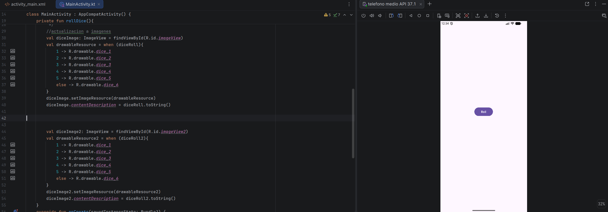
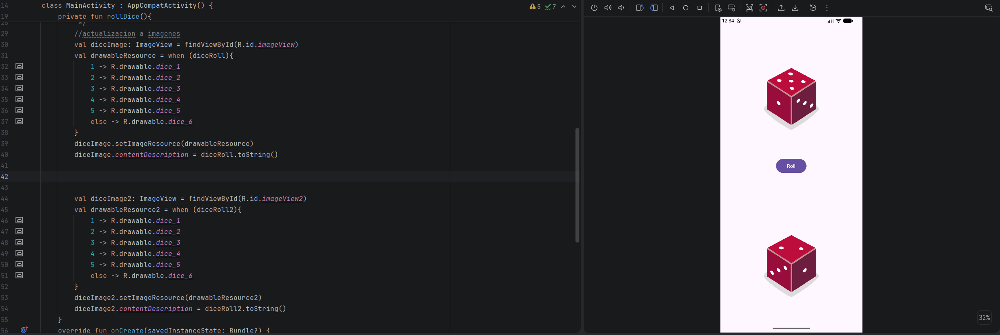

# <center>IES FRANCISCO DE GOYA</center>
__NOMBRE:__ Martin Taboada  
__CURSO:__ DAM 2
## <center> __Programación Multimedia y Dispositivos Móviles:__</center>   <center> __Lanzador de dados__</center>
A continuación se presentarán evidencias sobre el ejercicio planteado en el aula virtual, se presentarán tanto las imágenes como el texto plano del fragmento del código:  
### __MainActivity.kt__
```
package com.example.diceroller

import android.os.Bundle
import android.widget.Button
import android.widget.ImageView
import android.widget.TextView
import android.widget.Toast
import androidx.activity.enableEdgeToEdge
import androidx.appcompat.app.AppCompatActivity
import androidx.core.view.ViewCompat
import androidx.core.view.WindowInsetsCompat
import org.w3c.dom.Text

class MainActivity : AppCompatActivity() {
    class Dice(val numSides: Int) {
        fun roll(): Int{
            return (1..numSides).random()   }
    }
    private fun rollDice(){
        val dice = Dice(6)
        val diceRoll = dice.roll()
        val diceRoll2 = dice.roll()
        /*val resultTextView: TextView = findViewById(R.id.textView)
        resultTextView.text = diceRoll.toString()
        val resultTextView2: TextView = findViewById(R.id.textView2)
        resultTextView2.text = diceRoll2.toString()

         */
        //actualizacion a imagenes
        val diceImage: ImageView = findViewById(R.id.imageView)
        val drawableResource = when (diceRoll){
            1 -> R.drawable.dice_1
            2 -> R.drawable.dice_2
            3 -> R.drawable.dice_3
            4 -> R.drawable.dice_4
            5 -> R.drawable.dice_5
            else -> R.drawable.dice_6
        }
        diceImage.setImageResource(drawableResource)
        diceImage.contentDescription = diceRoll.toString()


        val diceImage2: ImageView = findViewById(R.id.imageView2)
        val drawableResource2 = when (diceRoll2){
            1 -> R.drawable.dice_1
            2 -> R.drawable.dice_2
            3 -> R.drawable.dice_3
            4 -> R.drawable.dice_4
            5 -> R.drawable.dice_5
            else -> R.drawable.dice_6
        }
        diceImage2.setImageResource(drawableResource2)
        diceImage2.contentDescription = diceRoll2.toString()
    }
    override fun onCreate(savedInstanceState: Bundle?) {
        super.onCreate(savedInstanceState)
        enableEdgeToEdge()
        setContentView(R.layout.activity_main)
        val rollButton : Button = findViewById(R.id.button)
        /*rollButton.setOnClickListener {
            val toast = Toast.makeText(this, "DiceRolled!", Toast.LENGTH_SHORT)
            toast.show()
            // También se puede hacer asi:
            // Toast.makeText(this,"Dice Rolled!", Toast.LENGHT_SHORT).show()
            val resultTextView: TextView = findViewById(R.id.textView)
            resultTextView.text = "6"
        }

         */
        // PARA EL LANZAMIENTO DE DADOS
        rollButton.setOnClickListener { rollDice() }
    }
}
```

### __Evidencias de funcionamiento:__


