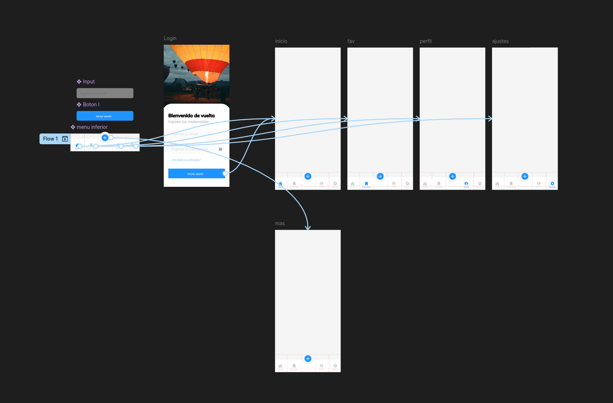
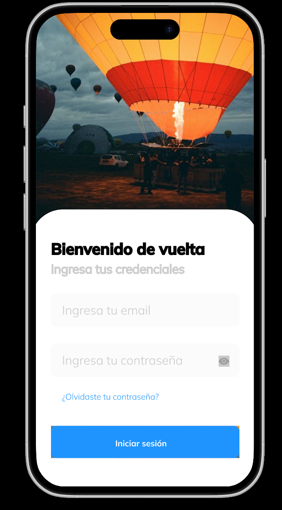
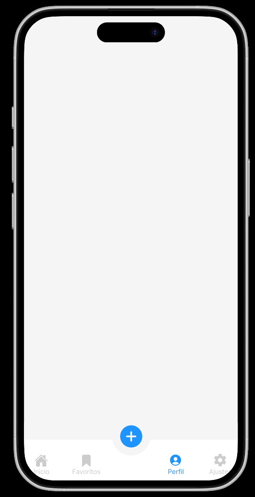
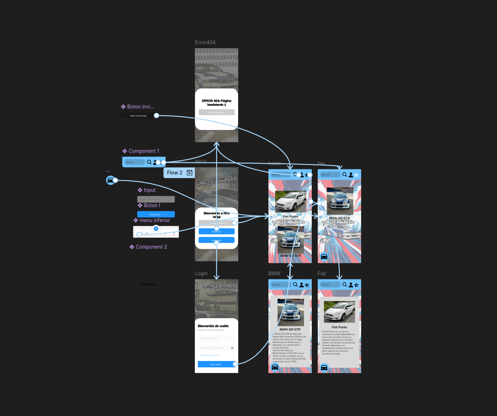
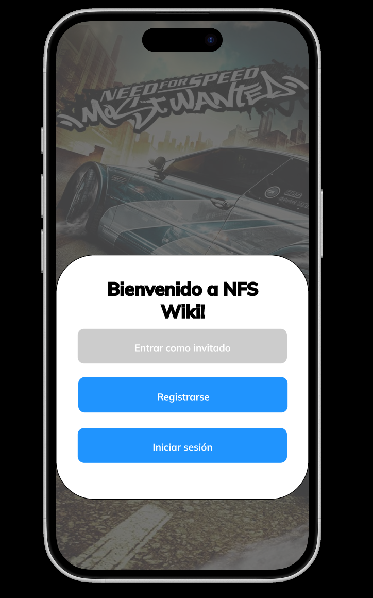
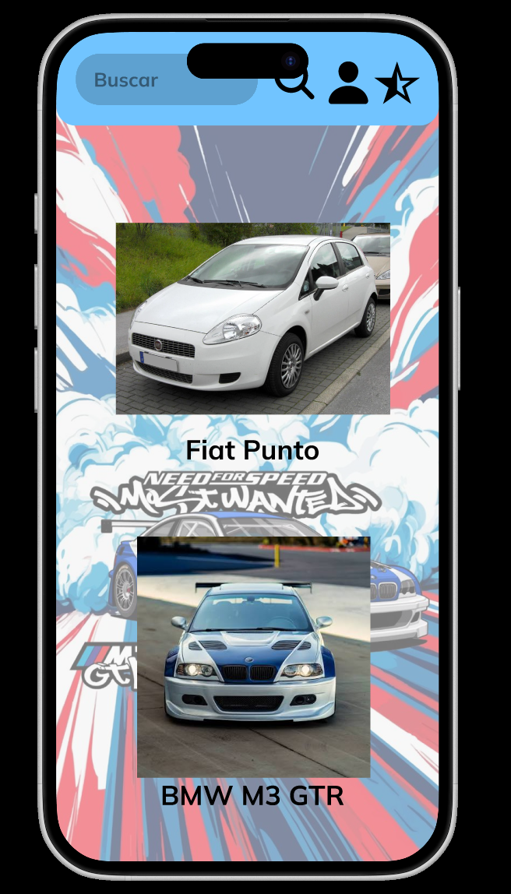
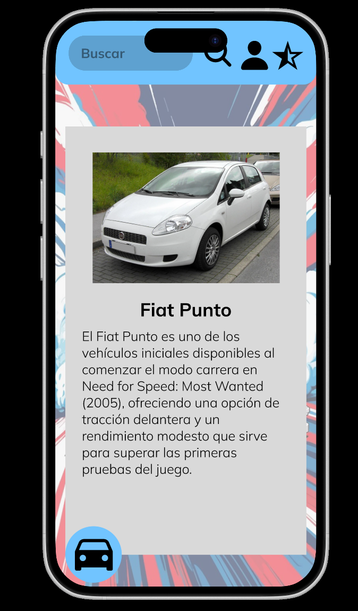

# 
IES FRANCISCO DE GOYA

__NOMBRE:__ Martin Taboada  
__CURSO:__ DAM 2
## 
 __Figma: Práctica 1__
   
 __Evidenciación de pruebas y creacion de web propia__

### __1. Seguimiento del tutorial__

### __2. Creación de la propia interfaz__

Para este caso se ha optado por hacer una "wiki" sobre el videojuego "Need for Speed: Most Wanted(2005). La decision de diseño presente en la aplicación web tiene su razón de ser debido a un intento de homenaje a las antiguas "wikis" de internet.
   

El resultado de la misma se puede ver en el enlace y en las capturas que se ven a continuacion:
  

[Need For Speed Most Wanted(2005) Wiki](https://www.figma.com/design/7hoD1MqIeSP2kQOJo918fa/Wiki-NFS-Most-Wanted?node-id=0-1&t=w0luLbCX9Wphk0ee-1) 

### __3. Antes de entregar__

Observa tu diseño y comprueba:  

- __¿Se entiende rápidamente para qué sirve?__  
        Considerando el fondo y el texto principal de la pagina de inicio, se comprende la función del proyecto
- __¿Se distingue cuál es la acción principal?__  
        A pesar de que los diseños tengan una apariencia anticuada, se considera que la acción principal llega a entenderse: ver información acerca del videojuego
- __¿Los elementos están correctamente alineados?__  
        Se ha tratado de hacer lo posible por una alineación adecuada, sin embargo, hay presentes algunos fallos en cuanto a este tema
- __¿Existe suficiente espacio entre ellos?__  
        El espacio ocupado llega a ser muy irregular y algo grande, considerando un teléfono móvil de esta época
- __¿Los colores mantienen una cierta coherencia?__  
        No se presenta una coherencia en los colores del botón de inicio de sesión y la barra de navegación dentro de la web
- __¿Los textos se pueden leer correctamente?__  
        Sí, se ha tratado de mantener un tamaño suficientemente grande como para que se pueda apreciar todo
- __¿La información importante destaca sobre la secundaria?__  
        se trata de descatar los botones y la infromacion con contrastes de colores.
- __¿Las dos pantallas mantienen el mismo estilo?__  
        Como se ha comentado previamente, llega a existir un desvalance entre la pàgina de inicio y las demás páginas en cuanto al color y algo del estilo.

