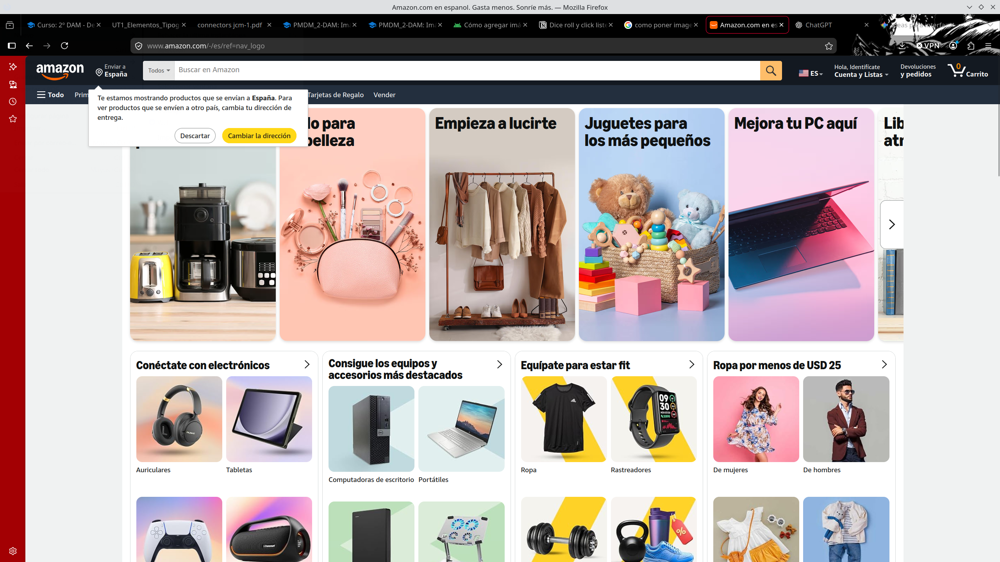
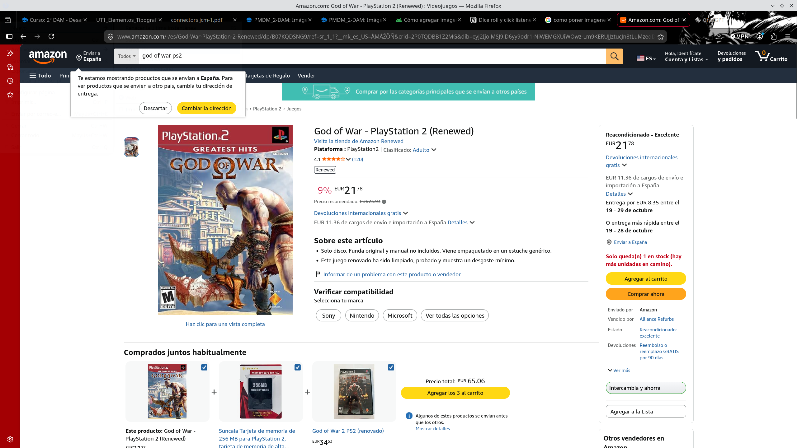

# 
IES FRANCISCO DE GOYA

__NOMBRE:__ Martin Taboada  
__CURSO:__ DAM 2
## 
 __Desaroolo de Interfaces:__
   
 __Elementos, tipografía y colores__

Para el presente trabajo, el diseño de la página a analizar será de Amazon, las capturas de pantalla se muestran a continuación:

 

### __Parte 1: Análisis del color__
1. __Identificación de colores principales__

| Color | ¿Dónde aparece? | ¿Qué significado parece tener? |
| ------------ | ------------ | ------------ |
| A      | Una fábrica sustituye luminarias antiguas por sistemas LED de bajo consumo.      | Eficiencia energética      |
| B      | Una empresa compra materias primas únicamente a proveedores con compromisos ambientales y laborales.      | Cadena de suministro sostenible      |
| C      | Una compañía publica cada año sus emisiones y sus objetivos de reducción.     | Transparencia y rendición de cuentas      |

__(La otra parte de las anotaciones del color)__

2. __¿El uso del color es coherente?__

3. __¿Depende únicamente del color?__

### __Parte 2: Tipografía y Tipografía visual__

1. __Localización de elementos__

2. __¿En qué sección es el primer vistazo?__

### __Parte 3: Distribución e íconos__

1. __Análisis de distribución__

2. __Análisis de tres íconos__

| Ícono | ¿Qué significa? | ¿Tiene texto? |  ¿Se entiende sin texto? |
| ------------ | ------------ | ------------ | ------------ |
| A      | Una fábrica sustituye luminarias antiguas por sistemas LED de bajo consumo.      | Eficiencia energética      |      |
| B      | Una empresa compra materias primas únicamente a proveedores con compromisos ambientales y laborales.      | Cadena de suministro sostenible      |      |
| C      | Una compañía publica cada año sus emisiones y sus objetivos de reducción.     | Transparencia y rendición de cuentas      |      |
### __Parte 4: Elementos interactivos__

| Elemento encontrado | Tipo de control | ¿Para qué sirve? |  ¿Es apropiado? |
| ------------ | ------------ | ------------ | ------------ |
| A      | Una fábrica sustituye luminarias antiguas por sistemas LED de bajo consumo.      | Eficiencia energética      |      |
| B      | Una empresa compra materias primas únicamente a proveedores con compromisos ambientales y laborales.      | Cadena de suministro sostenible      |      |
| C      | Una compañía publica cada año sus emisiones y sus objetivos de reducción.     | Transparencia y rendición de cuentas      |      |

1. __Acción principal__

### __Parte 5: Elementos interactivos__
1. __Análisis del elemento que cambie de estado__

2. __PRovocación de respuesta en el sistema__

