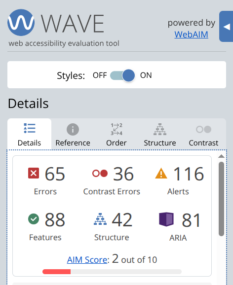
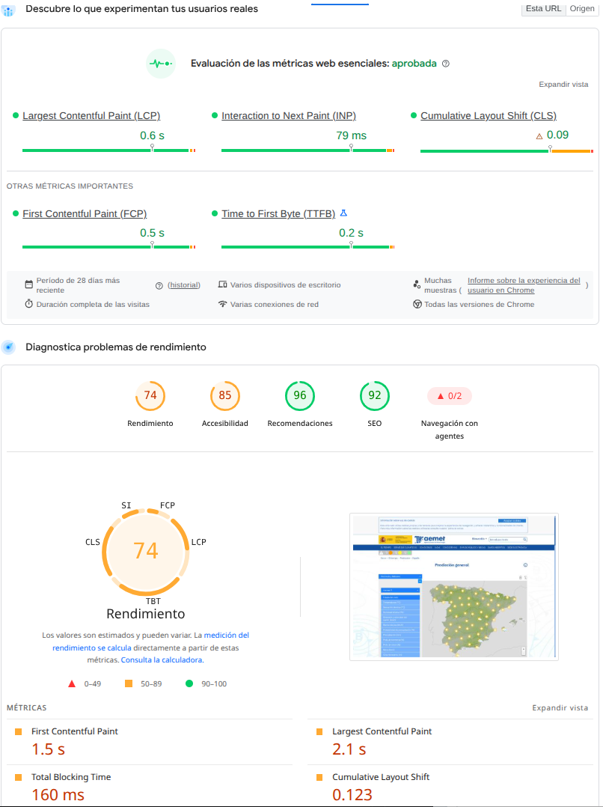
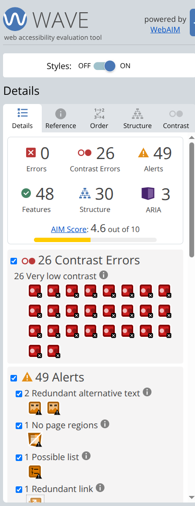

# <center>IES FRANCISCO DE GOYA</center>
__NOMBRE:__ Martin Taboada  
__CURSO:__ DAM 2
## <center> __Desarollo de Interfaces:__</center>   <center> __Auditoría práctica de usabilidad y accesibilidad__</center>

### __1. Medición de Usabilidad:__

&emsp;__Prueba 1 de usabilidad:__
| __Medida__ | __Resultado__ | 
| ------------ | ------------ | 
|   ¿Has completado la tarea?      |    Símon    |
|    Tiempo empleado     |     53″ |
|    Número aproximado de interacciones     |    4/5    |
|   Retrocesos      |    1    |
|    Errores     |    1    |
| Momentos de duda |    2    |

&emsp;&emsp; Se considera como una tarea parcialmente eficaz, debido a que, en principio, por la cantidad de información, el usuario se llega a sobrecargar; además, la elección de ```El tiempo: Predicción general```, a pesar de que sobresale por el contraste de color con el blanco, no sobresale en cuanto a otras opciones.

&emsp;__Prueba 2 de usabilidad__

| __Medida__ | __Resultado__ | 
| ------------ | ------------ | 
|   ¿Has completado la tarea?      |   Sí     |
|    Tiempo empleado     |     33″   |
|    Número aproximado de interacciones     |    3    |
|   Retrocesos      |    0   |
|    Errores     |    0    |
| Momentos de duda |    1    |


&emsp; __Comparación de las dos tareas__

&emsp;&emsp;  <div align="justify">Considerando las dos pruebas, en todas las medidas, llega a tener mejores resultados la segunda prueba, esto debido a dos factores clave: la opcion de ```Meteoalerta``` es la primera opción dentro del contenedor; la segunda se debe a una mayor familiarización de la página por parte del usuario.


### __2. Introducción a la accesibilidad__
<div align="justify">

&emsp; __- Prueba de teclado:__ Llega a ser funcional, pero su uso es dificultoso y algo molesto; quisera resaltar el hecho de los focos al momento de visualizar el mapa, porque estos en un principio aparecen, sin embargo, luego desaparecen; finalmente, navegar por la barra de opciones y no por el mapa para vizualizar los avisos meteorológicos por zonas resulta tedioso, no se puede abrir el desplegable para seleccionar la comunidad autónoma, hay que cambiarlo, uno por uno con las flechas y cada vez que se cambia de comunidad autóma, la página se recarga. Esta prueba aplica mucho con el principio de operabilidad.

&emsp; __- Prueba de ampliación:__ La web responde muy bien ante la prueba, la funcionalidad no se ve afectada, no desaparecen componentes, y el único inconveniente posible puede ser que ciertos botones se interponen en la pantalla principal. Con respecto a los principios POUR, este cumple eficientemente.


### __3. Herramietnas de accesibilidad__
&emsp; __Análisis con WAVE o Lighthouse__

Las paginas a analizar seran las siguientes:
- [Página principal](https://www.aemet.es/es/portada): Esta fue analizada con la extensión de WAVE, esta lanzó varios errores con respecto al contraste, texto en imagenes no encontradas y alertas con respecto a muchos elementos redundantes. El problema que más resalta son las imagenes sin texto alternativo, esto porque dificulta la comprensión de la pagina por las personas no videntes, además, en el caso de que el usuario no pueda acceder a las imágenes, este se guiará menos sin ese texto alternativo




- [Prediccion general del tiempo](https://www.aemet.es/es/eltiempo/prediccion/espana?a=pb): Lo que lanzó el reporte de Lighthouse fue algo similar a lo que lanzó WAVE con la página principal en cuanto a los errores con las imágenes sin texto o problemas con relación al contraste. Los aspectos que resaltan son problemas de rendimiento y accesibilidad.



- [Información de relevancia jurídica](https://www.aemet.es/es/conocenos/transparencia/relevancia-juridica): Esta página al ser analizada por WAVE, presenta menos problemas que la página principal, sin embargo, hay menos elementos. Los problemas que presenta tienen que ver más por contraste



</div>

### __4. Interpretar los resultados__

| __Principio__ | __Ejemplo encontrado__ | 
| ------------ | ------------ | 
|   Perceptible      |   A pesar de que, personalmente no se aprecian problemas en cuanto a contraste, las extensioens analizaban varios problemas de la índole en cuanto al fondo y a las barras de navegación     |
|   Operable         |    PResenta un gran problema al quere navegar con ciertas páginas que utilicen un mapa con el teclado    |
|   Comprensible     |    Es su punto fuerte, pero debido al exceso de infromación en la pantalla principal, puede confundir un poco   |
|   Robusto          |    Tiene varios problemas de rendimiento    |


<div align="justify">

&emsp; __Valoración de la usabilidad__: La usabilidad de la página se puede considerar media, esto debido a que al principio es complicada de entender por la cantidad de información ya mencionada en la página principal. Requiere un poco de uso con la página para que existan menos errores y un menor tiempo perdido en encontrar cierta información.

&emsp; __Valoración de la accesibilidad__: Considero que la página es adecuada para el público al que abarca, a pesar de que todo el mundo puede visitar la página y puede tener interés en la predicción del tiempo, seguramente no visitaría la página por las facilidades que los dispositivos móviles brindan en cuanto a la visualización del tiempo. Los problemas más presentes en la página son los mencionados en cuanto a la operabilidad con la dificultad del uso del teclado y los problemas que pueden surgir para las personas no videntes con la lectura de las imagenes.</div>

<div align="justify">
</div>
<br>