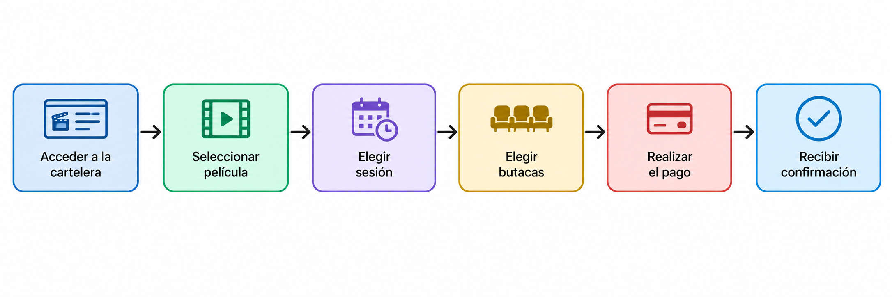
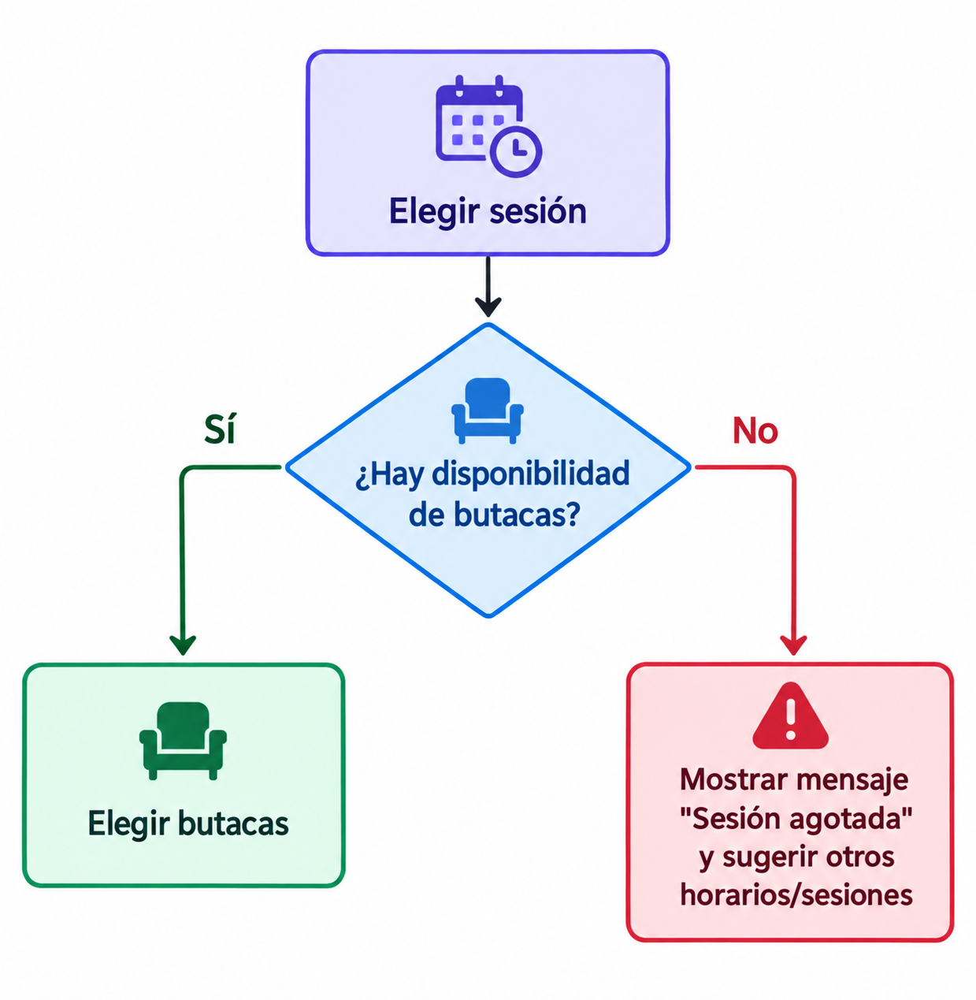
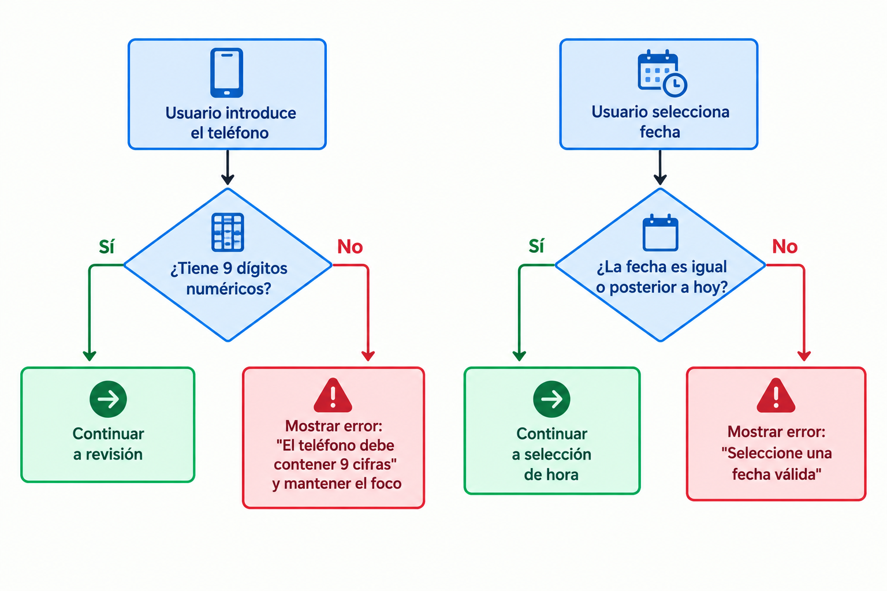
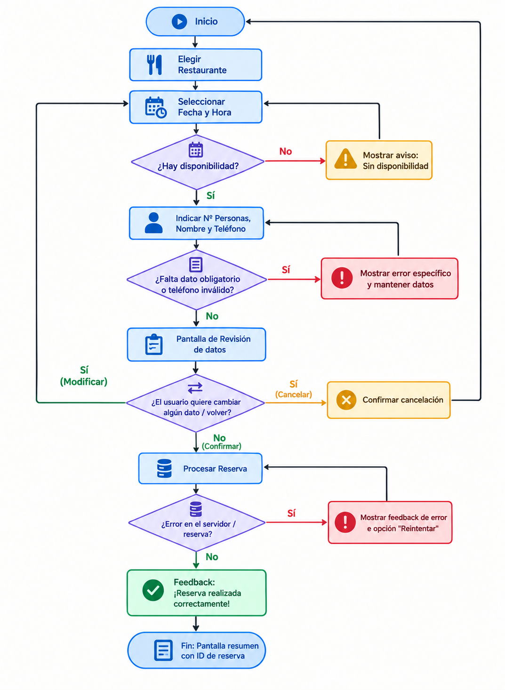

# 
IES FRANCISCO DE GOYA

__NOMBRE:__ Martin Taboada  
__CURSO:__ DAM 2
## 
 __Desarollo de Interfaces:__
   
 __Secuencia de control de una aplicación__

### __El flujo principal:__

   En una aplicación de compra de entradas de cine, el recorrido lógico y lineal que sigue el usuario cuando la transacción se completa sin ningún tipo de inconveniente se compone de los siguientes pasos ordenados:
1. Acceder a la cartelera
2. Seleccionar película
3. Elegir sesión
4. Elegir butacas
5. Realizar el pago
6. Recibir confirmación

__Representación del flujo principal:__

### __Decisiones y caminos alternativos:__

   Cuando la disponibilidad de entradas es limitada, la secuencia de control debe contemplar un punto de decisión crítico:   
- Momento de comprobación: Justo después de que el usuario selecciona la sesión y la cantidad de entradas deseadas, antes de dar paso al mapa de selección de butacas.   
- Pregunta en el rombo de decisión: ¿Hay butacas disponibles suficientes para la sesión seleccionada?   
- Camino SÍ: La aplicación redirige al usuario a la pantalla de Elegir butacas para continuar el proceso de compra.   
- Camino NO: Se muestra una alerta en pantalla indicando la falta de aforo y se redirige al usuario a la vista de Elegir sesión con las sesiones agotadas deshabilitadas o sugiriendo horarios alternativos.   

### __Validaciones:__

   Para asegurar la integridad de la reserva de una mesa en un restaurante, es indispensable validar los datos introducidos antes de procesar la solicitud:

| Dato | Regla de validación | 
| ------------ | ------------ | 
|  Nombre   |    Campo obligatorio. Verificar que no esté vacío y contenga solo caracteres alfabéticos.       |
|   Número de personas  |   Campo obligatorio. Verificar que sea un valor numérico entero positivo (mínimo 1, máximo según aforo).        |
|  Fecha   |     Campo obligatorio. Verificar que la fecha sea igual o posterior al día actual y en un día de apertura.      |
|  Hora   |    Campo obligatorio. Verificar que la hora esté dentro del rango de servicio del restaurante.       |
|   Teléfono  |    Campo obligatorio. Verificar que contenga exactamente 9 dígitos numéricos sin letras.       |
|   Observaciones  |     Campo opcional. Limitar el número máximo de caracteres (ej. máximo 250) para evitar desbordamientos.      |

__Flujo de validación 1: Formato de teléfono__

__Flujo de validación 2: Selección de fecha__

### __Errores y recuperación:__

   La gestión de errores debe enfocarse en orientar al usuario sin hacerle perder el progreso:   
- __Caso A: ERROR__ 

&emsp;&emsp;&emsp;&emsp;- Problema: Es un mensaje ambiguo que genera incertidumbre, el usuario no sabe qué falló ni cómo solucionarlo.   
&emsp;&emsp;&emsp;&emsp;- Mejora: Explicar la causa concreta. Ejemplo: "No se pudo conectar con el servidor. Revisa tu conexión a internet e inténtalo de nuevo."
- __Caso B: Datos incorrectos__

&emsp;&emsp;&emsp;&emsp;- Problema: Aunque indica que el fallo proviene de los datos, obliga al usuario a revisar campo por campo sin saber cuál está mal.

&emsp;&emsp;&emsp;&emsp;- Mejora: Señalar el campo específico afectado y el motivo. Ejemplo: "El correo electrónico introducido no tiene un formato válido (ejemplo@dominio.com)."
- __Caso C: Borrado completo de datos al equivocar el teléfono__

&emsp;&emsp;&emsp;&emsp;- Problema: Provoca máxima frustración al penalizar al usuario destruyendo información que ya había rellenado correctamente.

&emsp;&emsp;&emsp;&emsp;- Mejora: Mantener todos los campos válidos intactos, resaltar en rojo únicamente el campo Teléfono y situar el foco del cursor sobre este para su corrección.

### __Volver, cancelar y deshacer:__
   Dada la secuencia: Elegir restaurante $\rightarrow$ Elegir fecha $\rightarrow$ Elegir hora $\rightarrow$ Introducir datos $\rightarrow$ Revisar $\rightarrow$ Confirmar:   
- Acción de Volver: Debe estar disponible mediante un botón visible en las pantallas de Elegir fecha, Elegir hora, Introducir datos y Revisar. Permite retroceder un paso en la jerarquía.   
- Acción de Modificar: Debe situarse explícitamente en la pantalla de Revisar, permitiendo al usuario saltar directamente a editar la fecha, hora o datos personales sin perder los demás campos ya completados.   
- Acción de Cancelar: Debe ser accesible desde cualquier punto del flujo mediante una opción fija (icono "X" o botón "Cancelar") hasta antes de pulsar Confirmar.

   Tratamiento de los datos: Mientras el usuario navegue hacia atrás o adelante, los datos deben permanecer guardados en la memoria del estado de la aplicación. Si el usuario pulsa Cancelar, la aplicación solicitará una confirmación breve para no perder la información por accidente. 

### __Confirmaciones:__
| Escenario | ¿Requiere confirmación? | Justificación |
| ------------ | ------------ | ------------ |
| Abrir la ficha de un restaurante       |    No    |    Es una acción básica de navegación que no altera datos ni genera cobros.      |
|   Eliminar definitivamente una cuenta     |   Si     |    Es una acción destructiva e irreversible con pérdida total de datos.      |
|  Añadir un producto al carrito      |    No    |    Es una acción fácilmente reversible desmarcando o quitando el ítem.      |
|  Cancelar una reserva ya pagada     |    Si    |  Implica efectos económicos, políticas de cancelación y pérdida del cupo.        |
|   Cambiar de pestaña     |     No   |    Es una interacción de exploración habitual; pedir confirmación interrumpiría la UX.      |
|   Borrar un documento sin posibilidad de recuperarlo     |    Si    |   Implica una pérdida permanente de información que no se puede deshacer.       |

### __Feedback:__

   Respuestas visuales que la interfaz debe proporcionar ante cada estado:   
- El usuario pulsa «Pagar»: El botón cambia inmediatamente a estado deshabilitado para evitar doble clic y su etiqueta pasa a "Procesando...".   
- El pago tarda varios segundos: Se muestra un indicador de carga animado (spinner) en el centro con el texto: «Procesando tu pago de forma segura, no cierres la ventana...».   
- El pago se realiza correctamente: Transición a un icono modal verde con el mensaje: «¡Pago realizado con éxito! Generando tu comprobante...».   
- El pago es rechazado: Mensaje de alerta destacado en rojo: «Transacción rechazada por la entidad bancaria. Por favor, verifica el saldo o intenta con otra tarjeta.».   
- El usuario guarda un formulario correctamente: Notificación flotante (toast) temporal en la parte superior: «Cambios guardados correctamente.».   

### __Fin de la tarea:__
- Problema para el usuario: Si la app vuelve directamente al inicio sin avisar, el usuario sufrirá incertidumbre sobre si el pago se cobró, si la reserva fue registrada o si ocurrió un fallo del sistema.   
- Información que debe mostrarse:
Mensaje claro de éxito (ej. «¡Reserva confirmada!»).   
Número de localizador o ID de reserva.   
Resumen completo de la transacción: nombre del restaurante, fecha, hora, número de comensales e importe pagado.   
Aviso de que se ha enviado un correo con el comprobante.   
- Acciones posteriores a ofrecer:
Ver mi reserva   
Guardar en el calendario
Volver al inicio

### __Caso práctico: reserva de una mesa__
A continuación se presenta el diagrama general de la secuencia de control para la reserva de mesa, incluyendo los flujos alternativos de disponibilidad, validaciones, errores y cancelaciones:

### __Revisión de flujo:__
- ¿Puedo terminar la reserva si todo va bien?: Sí, a través del flujo principal (Happy Path) desde la selección hasta la pantalla final.   
- ¿Qué ocurre si cometo un error?: El sistema lo detecta mediante los nodos de decisión/validación y notifica la causa exacta.   
- ¿Puedo corregirlo?: Sí, el foco se mantiene en el campo erróneo sin borrar la información correcta preexistente.   
- ¿Puedo volver atrás?: Sí, desde la pantalla de revisión es posible retornar a la selección de datos o fecha.   
- ¿Puedo cancelar?: Sí, el usuario puede cancelar la reserva en la pantalla de revisión previa confirmación.   
- ¿Pierdo los datos innecesariamente?: No, los datos introducidos se preservan durante los saltos entre pantallas e intentos de corrección.   
- ¿Sé qué está haciendo la aplicación?: Sí, mediante mensajes de feedback visual durante la carga, errores y confirmaciones.   
- ¿Sé claramente cuándo ha terminado?: Sí, finaliza en un estado explícito con código de reserva y resumen detallado en pantalla.   

