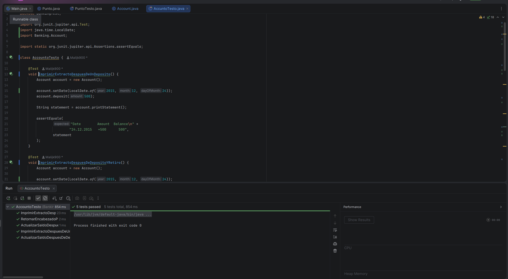

# <center>IES FRANCISCO DE GOYA</center>
__NOMBRE:__ Martin Taboada  
__CURSO:__ DAM 2
## <center> __Entornos de Desarrollo:__</center>   <center> __Banking Kata__</center>
A continuación se presentarán evidencias sobre el ejercicio planteado en el aula virtual, se presentarán tanto las imágenes como el texto plano del fragmento del código: 
### __Código del programa__ 
```
package Banking;

import java.time.LocalDate;
import java.time.format.DateTimeFormatter;
import java.util.ArrayList;
import java.util.List;

public class Account {

    private static final DateTimeFormatter DATE_FORMATTER =
            DateTimeFormatter.ofPattern("d.M.yyyy");

    private int balance = 0;

    private final List<Transaction> transactions = new ArrayList<>();

    private LocalDate currentDate;

    public Account() {
        this.currentDate = LocalDate.now();
    }

    public void deposit(int amount) {
        balance += amount;

        transactions.add(
                new Transaction(currentDate, amount, balance)
        );
    }

    public void withdraw(int amount) {
        balance -= amount;

        transactions.add(
                new Transaction(currentDate, -amount, balance)
        );
    }

    public void setDate(LocalDate date) {
        this.currentDate = date;
    }

    public String printStatement() {

        StringBuilder statement = new StringBuilder();

        statement.append("Date        Amount  Balance");

        for (int i = transactions.size() - 1; i >= 0; i--) {

            Transaction transaction = transactions.get(i);

            statement.append("\n");

            statement.append(
                    String.format(
                            "%-12s%+5d%9d",
                            transaction.date().format(DATE_FORMATTER),
                            transaction.amount(),
                            transaction.balance()
                    )
            );
        }

        return statement.toString();
    }

    private record Transaction(
            LocalDate date,
            int amount,
            int balance
    ) {
    }
}
```

### __Pruebas__ 
```
package BankingTest;

import org.junit.jupiter.api.Test;
import java.time.LocalDate;
import Banking.Account;

import static org.junit.jupiter.api.Assertions.assertEquals;

class AccountoTesto {

    @Test
    void ImprimirExtractoDespuesDeUnDeposito() {
        Account account = new Account();

        account.setDate(LocalDate.of(2015, 12, 24));
        account.deposit(500);

        String statement = account.printStatement();

        assertEquals(
                "Date        Amount  Balance\n" +
                        "24.12.2015   +500      500",
                statement
        );
    }

    @Test
    void ImprimirExtractoDespuesDeDepositoYRetiro() {
        Account account = new Account();

        account.setDate(LocalDate.of(2015, 12, 24));
        account.deposit(500);

        account.setDate(LocalDate.of(2016, 8, 23));
        account.withdraw(100);

        String statement = account.printStatement();

        assertEquals(
                "Date        Amount  Balance\n" +
                        "23.8.2016    -100      400\n" +
                        "24.12.2015   +500      500",
                statement
        );
    }

    @Test
    void ActualizarSaldoDespuesDeDeposito() {
        Account account = new Account();

        account.setDate(LocalDate.of(2015, 12, 24));
        account.deposit(500);
        account.deposit(300);

        String statement = account.printStatement();

        assertEquals(
                "Date        Amount  Balance\n" +
                        "24.12.2015   +300      800\n" +
                        "24.12.2015   +500      500",
                statement
        );
    }

    @Test
    void ActualizarSaldoDespuesDeRetiro() {
        Account account = new Account();

        account.setDate(LocalDate.of(2015, 12, 24));
        account.deposit(1000);

        account.setDate(LocalDate.of(2016, 8, 23));
        account.withdraw(300);

        String statement = account.printStatement();

        assertEquals(
                "Date        Amount  Balance\n" +
                        "23.8.2016    -300      700\n" +
                        "24.12.2015  +1000     1000",
                statement
        );
    }

    @Test
    void RetornarEncabezadoParaCuentaNueva() {
        Account account = new Account();

        assertEquals(
                "Date        Amount  Balance",
                account.printStatement()
        );
    }
}
```

### __Capturas de pantalla del fuincionamiento__
