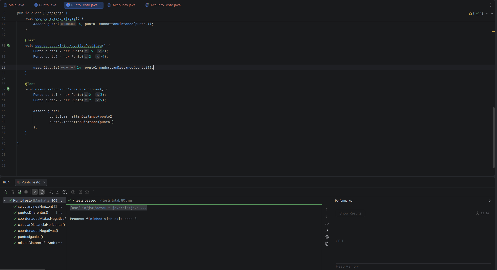

# <center>IES FRANCISCO DE GOYA</center>
__NOMBRE:__ Martin Taboada  
__CURSO:__ DAM 2
## <center> __Entornos de Desarrollo:__</center>   <center> __Manhattan Kata__</center>
A continuación se presentarán evidencias sobre el ejercicio planteado en el aula virtual, se presentarán tanto las imágenes como el texto plano del fragmento del código: 
### __Código del programa__ 
```
package Manhattan;

public class Punto {
    private final int x;
    private final int y;
    public Punto(int x, int y) {
        this.x = x; this.y = y;
    }
    public int manhattanDistance(Punto laOtra) {
        return Math.abs(this.x - laOtra.x) + Math.abs(this.y - laOtra.y);
    }
}

```

### __Pruebas__ 
```
package ManhattanTest;

import Manhattan.Punto;
import org.junit.jupiter.api.Test;

import static org.junit.jupiter.api.Assertions.assertEquals;

public class PuntoTesto {

    @Test
    void puntosIguales() {
        Punto punto1 = new Punto(0, 0);
        Punto punto2 = new Punto(0, 0);

        assertEquals(0, punto1.manhattanDistance(punto2));
    }

    @Test
    void calcularLineaHorizontal() {
        Punto punto1 = new Punto(0, 0);
        Punto punto2 = new Punto(5, 0);

        assertEquals(5, punto1.manhattanDistance(punto2));
    }

    @Test
    void calcularDiscanciaHorizontal() {
        Punto punto1 = new Punto(0, 0);
        Punto punto2 = new Punto(0, 5);

        assertEquals(5, punto1.manhattanDistance(punto2));
    }

    @Test
    void puntosDiferentes() {
        Punto punto1 = new Punto(1, 2);
        Punto punto2 = new Punto(4, 6);

        assertEquals(7, punto1.manhattanDistance(punto2));
    }

    @Test
    void coordenadasNegativas() {
        Punto punto1 = new Punto(-2, -3);
        Punto punto2 = new Punto(4, 5);

        assertEquals(14, punto1.manhattanDistance(punto2));
    }

    @Test
    void coordenadasMixtasNegativaPositiva() {
        Punto punto1 = new Punto(-5, 3);
        Punto punto2 = new Punto(2, -4);

        assertEquals(14, punto1.manhattanDistance(punto2));
    }

    @Test
    void mismaDistanciaEnAmbasDirecciones() {
        Punto punto1 = new Punto(2, 3);
        Punto punto2 = new Punto(7, 9);

        assertEquals(
                punto1.manhattanDistance(punto2),
                punto2.manhattanDistance(punto1)
        );
    }

}

```

### __Capturas de pantalla del fuincionamiento__

